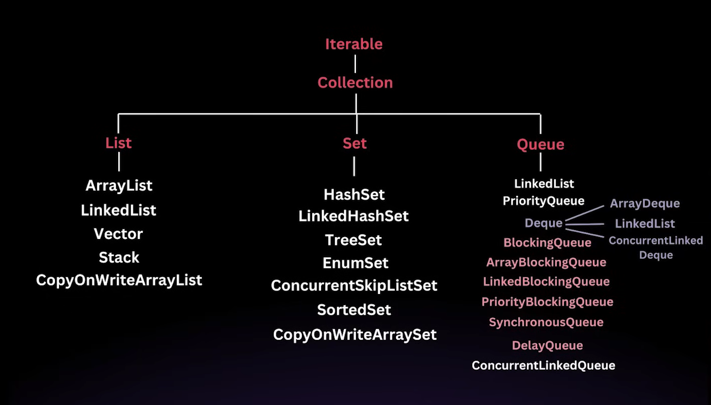

# Collection Framework

- A collection is simply an object that represents a group of objects, known as its elements.
- The collection framework provides a set of interfaces and classes that help in managing groups of objects.
- Before JDK 1.2, Java used to rely on classes such as `Vector`, `Stack`, `Hashtable`, etc to store and manipulate group of objects.

## Problems before the JCF

- Inconsistency: Each class had a different way of managing collections, leading to confusion and a steep learning curve.
- Lack of inter-operability: These classes were not designed to work seamlessly.
- No common interface: There was no common interface for all these classes, which meant you couldn't write generic algorithms that could operate on different types of collections.

## Introduction of JCF

- It was introduced in JDK 1.2.
- Unified architecture: A consistent set of interfaces for all collections.
- Inter-operability: Collections can be easily interchanged and manipulated in a uniform way.
- Reusability: Generic algorithms can be written that work with any collection.
- Efficiency: The framework provides efficient algorithms for basic operations like searching, sorting and manipulation.

## Key interfaces in the JCF

1. `Collection`: The root interface for all the other collection types.
2. `List`: An ordered collection that can contain duplicate elements (e.g., `ArrayList`, `LinkedList`).
3. `Set`: A collection that cannot contain duplicate elements (e.g., `HashSet`, `TreeSet`).
4. `Queue`: A collection designed for holding elements prior to processing (e.g., `PriorityQueue`, `LinkedList` when used as a queue).
5. `Deque`: A double-ended queue that allows insertion and removal from both ends (e.g., `ArrayDeque`).
6. `Map`: An interface that represents a collection of key-value pairs (e.g., `HashMap`, `TreeMap`).

- `Iterable` is the root interface.
- For any class that implements the `Iterable` interface, we can use the for-each loop on that class.
- `Map` is a separate interface.
